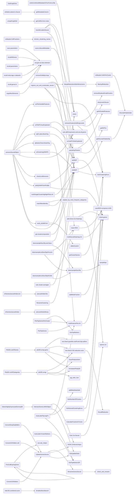

# Function relationships

> (of connected functions)

```mermaid
 flowchart LR 

  writeCombinedMetadataToTsvFromLsObj(writeCombinedMetadataToTsvFromLsObj) --> xsave(xsave)
  whitelist.subset.ls.Seurat(whitelist.subset.ls.Seurat) --> getMetadataColumn(getMetadataColumn)
  umapHiLightSel(umapHiLightSel) --> getCellIDs.from.meta(getCellIDs.from.meta)
  transferLabelsSeurat(transferLabelsSeurat) --> xsave(xsave)
  transferLabelsSeurat(transferLabelsSeurat) --> qUMAP(qUMAP)
  transferLabelsSeurat(transferLabelsSeurat) --> clUMAP(clUMAP)
  scBarplot.CellsPerCluster(scBarplot.CellsPerCluster) --> DiscretePaletteSafe(DiscretePaletteSafe)
  scBarplot.CellFractions(scBarplot.CellFractions) --> shorten_clustering_names(shorten_clustering_names)
  saveLsSeuratMetadata(saveLsSeuratMetadata) --> xsave(xsave)
  save.parameters(save.parameters) --> ww.get.1st.Seur.element(ww.get.1st.Seur.element)
  removeClustersAndDropLevels(removeClustersAndDropLevels) --> removeResidualSmallClusters(removeResidualSmallClusters)
  removeClustersAndDropLevels(removeClustersAndDropLevels) --> dropLevelsSeurat(dropLevelsSeurat)
  removeClustersAndDropLevels(removeClustersAndDropLevels) --> GetClusteringRuns(GetClusteringRuns)
  removeCellsByUmap(removeCellsByUmap) --> clUMAP(clUMAP)
  regress_out_and_recalculate_seurat(regress_out_and_recalculate_seurat) --> calc.q99.Expression.and.set.all.genes(calc.q99.Expression.and.set.all.genes)
  regress_out_and_recalculate_seurat(regress_out_and_recalculate_seurat) --> isave.RDS(isave.RDS)
  regress_out_and_recalculate_seurat(regress_out_and_recalculate_seurat) --> qUMAP(qUMAP)
  regress_out_and_recalculate_seurat(regress_out_and_recalculate_seurat) --> SetupReductionsNtoKdimensions(SetupReductionsNtoKdimensions)
  regress_out_and_recalculate_seurat(regress_out_and_recalculate_seurat) --> clUMAP(clUMAP)
  regress_out_and_recalculate_seurat(regress_out_and_recalculate_seurat) --> GetClusteringRuns(GetClusteringRuns)
  recallAllGenes(recallAllGenes) --> ww.get.1st.Seur.element(ww.get.1st.Seur.element)
  recall.parameters(recall.parameters) --> ww.get.1st.Seur.element(ww.get.1st.Seur.element)
  recall.meta.tags.n.datasets(recall.meta.tags.n.datasets) --> ww.get.1st.Seur.element(ww.get.1st.Seur.element)
  recall.genes.ls(recall.genes.ls) --> ww.get.1st.Seur.element(ww.get.1st.Seur.element)
  scPlotPCAvarExplained(scPlotPCAvarExplained) --> scCalcPCAVarExplained(scCalcPCAVarExplained)
  scPlotPCAvarExplained(scPlotPCAvarExplained) --> .parseKeyParams(.parseKeyParams)
  qQC.plots.BrainOrg(qQC.plots.BrainOrg) --> qUMAP(qUMAP)
  qMarkerCheck.BrainOrg(qMarkerCheck.BrainOrg) --> multiFeaturePlot.A4(multiFeaturePlot.A4)
  qClusteringUMAPS(qClusteringUMAPS) --> clUMAP(clUMAP)
  processSeuratObject(processSeuratObject) --> suPlotVariableFeatures(suPlotVariableFeatures)
  processSeuratObject(processSeuratObject) --> scPlotPCAvarExplained(scPlotPCAvarExplained)
  processSeuratObject(processSeuratObject) --> qQC.plots.BrainOrg(qQC.plots.BrainOrg)
  processSeuratObject(processSeuratObject) --> qMarkerCheck.BrainOrg(qMarkerCheck.BrainOrg)
  processSeuratObject(processSeuratObject) --> qClusteringUMAPS(qClusteringUMAPS)
  processSeuratObject(processSeuratObject) --> calc.q99.Expression.and.set.all.genes(calc.q99.Expression.and.set.all.genes)
  processSeuratObject(processSeuratObject) --> .checkListElements(.checkListElements)
  processSeuratObject(processSeuratObject) --> plotQUMAPsInAFolder(plotQUMAPsInAFolder)
  processSeuratObject(processSeuratObject) --> multi_clUMAP.A4(multi_clUMAP.A4)
  processSeuratObject(processSeuratObject) --> xsave(xsave)
  plotQUMAPsInAFolder(plotQUMAPsInAFolder) --> qUMAP(qUMAP)
  plotQUMAPsInAFolder(plotQUMAPsInAFolder) --> check.genes(check.genes)
  ww.check.if.3D.reduction.exist(ww.check.if.3D.reduction.exist) --> RecallReduction(RecallReduction)
  plot.Gene.Cor.Heatmap(plot.Gene.Cor.Heatmap) --> check.genes(check.genes)
  plot.Gene.Cor.Heatmap(plot.Gene.Cor.Heatmap) --> sparse.cor(sparse.cor)
  multi_clUMAP.A4(multi_clUMAP.A4) --> .adjustLayout(.adjustLayout)
  multi_clUMAP.A4(multi_clUMAP.A4) --> clUMAP(clUMAP)
  multiSingleClusterHighlightPlots.A4(multiSingleClusterHighlightPlots.A4) --> clUMAP(clUMAP)
  multiSeuratHeatmap.A4(multiSeuratHeatmap.A4) --> check.genes(check.genes)
  matchBestIdentity(matchBestIdentity) --> .replace_by_most_frequent_categories(.replace_by_most_frequent_categories)
  matchBestIdentity(matchBestIdentity) --> clUMAP(clUMAP)
  jPairwiseJaccardIndexList(jPairwiseJaccardIndexList) --> jJaccardIndexVec(jJaccardIndexVec)
  jPairwiseJaccardIndex(jPairwiseJaccardIndex) --> jJaccardIndexBinary(jJaccardIndexBinary)
  getClusterNames(getClusterNames) --> GetClusteringRuns(GetClusteringRuns)
  get.clustercomposition(get.clustercomposition) --> clUMAP(clUMAP)
  downsampleSeuObj.and.Save(downsampleSeuObj.and.Save) --> xsave(xsave)
  downsampleSeuObj.and.Save(downsampleSeuObj.and.Save) --> downsampleSeuObj(downsampleSeuObj)
  downsampleListSeuObjsPercent(downsampleListSeuObjsPercent) --> isave.RDS(isave.RDS)
  downsampleListSeuObjsPercent(downsampleListSeuObjsPercent) --> downsampleSeuObj(downsampleSeuObj)
  isave.RDS(isave.RDS) --> .saveRDS.compress.in.BG(.saveRDS.compress.in.BG)
  downsampleSeuObj(downsampleSeuObj) --> sampleNpc(sampleNpc)
  downsampleListSeuObjsNCells(downsampleListSeuObjsNCells) --> isave.RDS(isave.RDS)
  downsampleListSeuObjsNCells(downsampleListSeuObjsNCells) --> downsampleSeuObj(downsampleSeuObj)
  copyMiscElements(copyMiscElements) --> ww.get.1st.Seur.element(ww.get.1st.Seur.element)
  getDiscretePaletteObj(getDiscretePaletteObj) --> DiscretePaletteSafe(DiscretePaletteSafe)
  qUMAP(qUMAP) --> check.genes(check.genes)
  calc.cluster.averages(calc.cluster.averages) --> qUMAP(qUMAP)
  addMetaFraction(addMetaFraction) --> check.genes(check.genes)
  SetupReductionsNtoKdimensions(SetupReductionsNtoKdimensions) --> BackupReduction(BackupReduction)
  SelectHighlyExpressedGenesq99(SelectHighlyExpressedGenesq99) --> IntersectGeneLsWithObject(IntersectGeneLsWithObject)
  RenameGenesSeurat(RenameGenesSeurat) --> .check_and_rename(.check_and_rename)
  clUMAP(clUMAP) --> getDiscretePaletteObj(getDiscretePaletteObj)
  clUMAP(clUMAP) --> GetClusteringRuns(GetClusteringRuns)
  RenameClustering(RenameClustering) --> clUMAP(clUMAP)
  PrctCellExpringGene(PrctCellExpringGene) --> ww.calc_helper(ww.calc_helper)
  PrctCellExpringGene(PrctCellExpringGene) --> PrctCellExpringGene(PrctCellExpringGene)
  PlotTopGenesPerCluster(PlotTopGenesPerCluster) --> GetTopMarkers(GetTopMarkers)
  PlotTopGenesPerCluster(PlotTopGenesPerCluster) --> multiFeaturePlot.A4(multiFeaturePlot.A4)
  PlotTopGenes(PlotTopGenes) --> multiFeaturePlot.A4(multiFeaturePlot.A4)
  plot3D.umap.gene(plot3D.umap.gene) --> ww.check.quantile.cutoff.and.clip.outliers(ww.check.quantile.cutoff.and.clip.outliers)
  plot3D.umap.gene(plot3D.umap.gene) --> ww.check.if.3D.reduction.exist(ww.check.if.3D.reduction.exist)
  plot3D.umap.gene(plot3D.umap.gene) --> SavePlotlyAsHtml(SavePlotlyAsHtml)
  plot3D.umap.gene(plot3D.umap.gene) --> Annotate4Plotly3D(Annotate4Plotly3D)
  Plot3D.ListOfGenes(Plot3D.ListOfGenes) --> plot3D.umap.gene(plot3D.umap.gene)
  plot3D.umap(plot3D.umap) --> ww.check.if.3D.reduction.exist(ww.check.if.3D.reduction.exist)
  plot3D.umap(plot3D.umap) --> gg_color_hue(gg_color_hue)
  plot3D.umap(plot3D.umap) --> SavePlotlyAsHtml(SavePlotlyAsHtml)
  plot3D.umap(plot3D.umap) --> Annotate4Plotly3D(Annotate4Plotly3D)
  Plot3D.ListOfCategories(Plot3D.ListOfCategories) --> plot3D.umap(plot3D.umap)
  IntersectGeneLsWithObject(IntersectGeneLsWithObject) --> HGNC.EnforceUnique(HGNC.EnforceUnique)
  IntersectGeneLsWithObject(IntersectGeneLsWithObject) --> GetUpdateStats(GetUpdateStats)
  GetNumberOfClusters(GetNumberOfClusters) --> GetClusteringRuns(GetClusteringRuns)
  GetNamedClusteringRuns(GetNamedClusteringRuns) --> GetClusteringRuns(GetClusteringRuns)
  ConvertDropSeqfolders(ConvertDropSeqfolders) --> UpdateGenesSeurat(UpdateGenesSeurat)
  Convert10Xfolders.old(Convert10Xfolders.old) --> UpdateGenesSeurat(UpdateGenesSeurat)
  UpdateGenesSeurat(UpdateGenesSeurat) --> RenameGenesSeurat(RenameGenesSeurat)
  UpdateGenesSeurat(UpdateGenesSeurat) --> HGNC.EnforceUnique(HGNC.EnforceUnique)
  UpdateGenesSeurat(UpdateGenesSeurat) --> GetUpdateStats(GetUpdateStats)
  Convert10Xfolders(Convert10Xfolders) --> UpdateGenesSeurat(UpdateGenesSeurat)
  CalculateFractionInTrome(CalculateFractionInTrome) --> check.genes(check.genes)
  Calc.Cor.Seurat(Calc.Cor.Seurat) --> sparse.cor(sparse.cor)
  multiFeaturePlot.A4(multiFeaturePlot.A4) --> check.genes(check.genes)
  AutoLabelTop.logFC(AutoLabelTop.logFC) --> multiFeaturePlot.A4(multiFeaturePlot.A4)
  AutoLabelTop.logFC(AutoLabelTop.logFC) --> addMetaDataSafe(addMetaDataSafe)
  AutoLabelTop.logFC(AutoLabelTop.logFC) --> GetTopMarkersDF(GetTopMarkersDF)
  AutoLabel.KnownMarkers(AutoLabel.KnownMarkers) --> GetTopMarkersDF(GetTopMarkersDF)
  Add.DE.combined.score(Add.DE.combined.score) --> SmallestNonAboveX(SmallestNonAboveX)
  .parseKeyParams(.parseKeyParams) --> .getNrScaledFeatures(.getNrScaledFeatures)
  .parseKeyParams(.parseKeyParams) --> .getNrPCs(.getNrPCs)
subgraph SubGraphOne

end
```

*created by `convert_igraph_to_mermaid()`*
