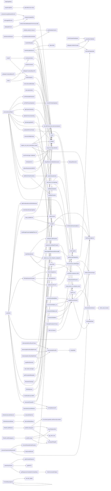

## Function relationships
 > (of connected functions)

------ Fri Aug 28 17:18:37 2026 -----

```mermaid
 flowchart LR 
  xread2(xread2) --> recall.parameters(recall.parameters)

  xread2(xread2) --> recall.all.genes(recall.all.genes)

  xread(xread) --> recall.parameters(recall.parameters)

  xread(xread) --> recall.all.genes(recall.all.genes)

  writeCombinedMetadataToTsvFromLsObj(writeCombinedMetadataToTsvFromLsObj) --> xsave(xsave)

  whitelist.subset.ls.Seurat(whitelist.subset.ls.Seurat) --> getMetadataColumn(getMetadataColumn)

  umapHiLightSel(umapHiLightSel) --> getCellIDs.from.meta(getCellIDs.from.meta)

  transferMetadata(transferMetadata) --> getMetadataColumn(getMetadataColumn)

  transferMetadata(transferMetadata) --> qUMAP(qUMAP)

  transferMetadata(transferMetadata) --> clUMAP(clUMAP)

  transferMetadata(transferMetadata) --> addMetaDataSafe(addMetaDataSafe)

  transferLabelsSeurat(transferLabelsSeurat) --> qSeuViolin(qSeuViolin)

  transferLabelsSeurat(transferLabelsSeurat) --> .parseBasicObjStats(.parseBasicObjStats)

  transferLabelsSeurat(transferLabelsSeurat) --> xsave(xsave)

  transferLabelsSeurat(transferLabelsSeurat) --> qUMAP(qUMAP)

  transferLabelsSeurat(transferLabelsSeurat) --> clUMAP(clUMAP)

  scPieClusterDistribution(scPieClusterDistribution) --> .parseBasicObjStats(.parseBasicObjStats)

  scGeneConceptNetworkEnrichr(scGeneConceptNetworkEnrichr) --> .emptyAnnotatedPlot(.emptyAnnotatedPlot)

  scGOEnrichment(scGOEnrichment) --> xsave(xsave)

  scEnhancedVolcano(scEnhancedVolcano) --> countRelevantEnrichments(countRelevantEnrichments)

  scEmapplotEnrichr(scEmapplotEnrichr) --> .emptyAnnotatedPlot(.emptyAnnotatedPlot)

  scBarplotEnrichr(scBarplotEnrichr) --> .emptyAnnotatedPlot(.emptyAnnotatedPlot)

  scBarplot.FractionBelowThr(scBarplot.FractionBelowThr) --> scBarplot.FractionAboveThr(scBarplot.FractionAboveThr)

  scBarplot.CellsPerCluster(scBarplot.CellsPerCluster) --> .parseBasicObjStats(.parseBasicObjStats)

  scBarplot.CellsPerCluster(scBarplot.CellsPerCluster) --> DiscretePaletteSafe(DiscretePaletteSafe)

  saveLsSeuratMetadata(saveLsSeuratMetadata) --> xsave(xsave)

  save.parameters(save.parameters) --> ww.get.1st.Seur.element(ww.get.1st.Seur.element)

  runDGEA(runDGEA) --> addCombinedScore2DGEAResults(addCombinedScore2DGEAResults)

  runDGEA(runDGEA) --> GetOrderedClusteringRuns(GetOrderedClusteringRuns)

  runDGEA(runDGEA) --> xsave(xsave)

  runDGEA(runDGEA) --> PlotTopGenesPerCluster(PlotTopGenesPerCluster)

  runDGEA(runDGEA) --> GetClusteringRuns(GetClusteringRuns)

  runDGEA(runDGEA) --> clUMAP(clUMAP)

  runDGEA(runDGEA) --> AutoNumber.by.UMAP(AutoNumber.by.UMAP)

  runDGEA(runDGEA) --> AutoLabelTop.logFC(AutoLabelTop.logFC)

  removeResidualSmallClusters(removeResidualSmallClusters) --> clUMAP(clUMAP)

  removeClustersAndDropLevels(removeClustersAndDropLevels) --> removeResidualSmallClusters(removeResidualSmallClusters)

  removeClustersAndDropLevels(removeClustersAndDropLevels) --> dropLevelsSeurat(dropLevelsSeurat)

  removeClustersAndDropLevels(removeClustersAndDropLevels) --> GetClusteringRuns(GetClusteringRuns)

  removeCellsByUmap(removeCellsByUmap) --> clUMAP(clUMAP)

  regress_out_and_recalculate_seurat(regress_out_and_recalculate_seurat) --> calc.q99.Expression.and.set.all.genes(calc.q99.Expression.and.set.all.genes)

  regress_out_and_recalculate_seurat(regress_out_and_recalculate_seurat) --> isave.RDS(isave.RDS)

  regress_out_and_recalculate_seurat(regress_out_and_recalculate_seurat) --> qUMAP(qUMAP)

  regress_out_and_recalculate_seurat(regress_out_and_recalculate_seurat) --> SetupReductionsNtoKdimensions(SetupReductionsNtoKdimensions)

  regress_out_and_recalculate_seurat(regress_out_and_recalculate_seurat) --> GetClusteringRuns(GetClusteringRuns)

  regress_out_and_recalculate_seurat(regress_out_and_recalculate_seurat) --> clUMAP(clUMAP)

  recall.parameters(recall.parameters) --> ww.get.1st.Seur.element(ww.get.1st.Seur.element)

  recall.meta.tags.n.datasets(recall.meta.tags.n.datasets) --> ww.get.1st.Seur.element(ww.get.1st.Seur.element)

  recall.genes.ls(recall.genes.ls) --> ww.get.1st.Seur.element(ww.get.1st.Seur.element)

  recall.all.genes(recall.all.genes) --> ww.get.1st.Seur.element(ww.get.1st.Seur.element)

  qGeneExpressionUMAPS(qGeneExpressionUMAPS) --> qUMAP(qUMAP)

  scPlotPCAvarExplained(scPlotPCAvarExplained) --> scCalcPCAVarExplained(scCalcPCAVarExplained)

  qQC.plots.BrainOrg(qQC.plots.BrainOrg) --> qUMAP(qUMAP)

  qMarkerCheck.BrainOrg(qMarkerCheck.BrainOrg) --> multiFeaturePlot.A4(multiFeaturePlot.A4)

  qClusteringUMAPS(qClusteringUMAPS) --> clUMAP(clUMAP)

  processSeuratObject(processSeuratObject) --> suPlotVariableFeatures(suPlotVariableFeatures)

  processSeuratObject(processSeuratObject) --> scPlotPCAvarExplained(scPlotPCAvarExplained)

  processSeuratObject(processSeuratObject) --> qQC.plots.BrainOrg(qQC.plots.BrainOrg)

  processSeuratObject(processSeuratObject) --> qMarkerCheck.BrainOrg(qMarkerCheck.BrainOrg)

  processSeuratObject(processSeuratObject) --> qClusteringUMAPS(qClusteringUMAPS)

  processSeuratObject(processSeuratObject) --> calc.q99.Expression.and.set.all.genes(calc.q99.Expression.and.set.all.genes)

  processSeuratObject(processSeuratObject) --> plotQUMAPsInAFolder(plotQUMAPsInAFolder)

  processSeuratObject(processSeuratObject) --> xsave(xsave)

  processSeuratObject(processSeuratObject) --> addGeneClassFractions(addGeneClassFractions)

  processSeuratObject(processSeuratObject) --> SetupReductionsNtoKdimensions(SetupReductionsNtoKdimensions)

  processSeuratObject(processSeuratObject) --> UpdateGenesSeurat(UpdateGenesSeurat)

  plotQUMAPsInAFolder(plotQUMAPsInAFolder) --> qUMAP(qUMAP)

  plotQUMAPsInAFolder(plotQUMAPsInAFolder) --> check.genes(check.genes)

  plot.Gene.Cor.Heatmap(plot.Gene.Cor.Heatmap) --> check.genes(check.genes)

  plot.Gene.Cor.Heatmap(plot.Gene.Cor.Heatmap) --> sparse.cor(sparse.cor)

  multi_clUMAP.A4(multi_clUMAP.A4) --> .adjustLayout(.adjustLayout)

  multi_clUMAP.A4(multi_clUMAP.A4) --> clUMAP(clUMAP)

  multiSingleClusterHighlightPlots.A4(multiSingleClusterHighlightPlots.A4) --> clUMAP(clUMAP)

  matchBestIdentity(matchBestIdentity) --> scBarplot.CellFractions(scBarplot.CellFractions)

  matchBestIdentity(matchBestIdentity) --> .replace_by_most_frequent_categories(.replace_by_most_frequent_categories)

  matchBestIdentity(matchBestIdentity) --> getDiscretePaletteObj(getDiscretePaletteObj)

  matchBestIdentity(matchBestIdentity) --> clUMAP(clUMAP)

  jPairwiseJaccardIndexList(jPairwiseJaccardIndexList) --> jJaccardIndexVec(jJaccardIndexVec)

  jPairwiseJaccardIndex(jPairwiseJaccardIndex) --> jJaccardIndexBinary(jJaccardIndexBinary)

  xsave(xsave) --> .map_preset_to_compress_level(.map_preset_to_compress_level)

  downsampleSeuObj.and.Save(downsampleSeuObj.and.Save) --> xsave(xsave)

  downsampleSeuObj.and.Save(downsampleSeuObj.and.Save) --> downsampleSeuObj(downsampleSeuObj)

  downsampleListSeuObjsPercent(downsampleListSeuObjsPercent) --> isave.RDS(isave.RDS)

  downsampleListSeuObjsPercent(downsampleListSeuObjsPercent) --> downsampleSeuObj(downsampleSeuObj)

  isave.RDS(isave.RDS) --> .saveRDS.compress.in.BG(.saveRDS.compress.in.BG)

  downsampleSeuObj(downsampleSeuObj) --> sampleNpc(sampleNpc)

  downsampleListSeuObjsNCells(downsampleListSeuObjsNCells) --> isave.RDS(isave.RDS)

  downsampleListSeuObjsNCells(downsampleListSeuObjsNCells) --> downsampleSeuObj(downsampleSeuObj)

  copyMiscElements(copyMiscElements) --> ww.get.1st.Seur.element(ww.get.1st.Seur.element)

  getDiscretePaletteObj(getDiscretePaletteObj) --> DiscretePaletteSafe(DiscretePaletteSafe)

  calc.cluster.averages(calc.cluster.averages) --> qUMAP(qUMAP)

  addTranslatedMetadata(addTranslatedMetadata) --> clUMAP(clUMAP)

  addGeneClassFractions(addGeneClassFractions) --> metaColnameExists(metaColnameExists)

  addGeneClassFractions(addGeneClassFractions) --> addMetaFraction(addMetaFraction)

  UpdateSeuratObjectProperly(UpdateSeuratObjectProperly) --> UpdateGenesSeurat(UpdateGenesSeurat)

  SetupReductionsNtoKdimensions(SetupReductionsNtoKdimensions) --> BackupReduction(BackupReduction)

  SelectHighlyExpressedGenesq99(SelectHighlyExpressedGenesq99) --> IntersectGeneLsWithObject(IntersectGeneLsWithObject)

  RenameGenesSeurat(RenameGenesSeurat) --> .check_and_rename(.check_and_rename)

  RenameClustering(RenameClustering) --> clUMAP(clUMAP)

  PrctCellExpringGene(PrctCellExpringGene) --> ww.calc_helper(ww.calc_helper)

  PrctCellExpringGene(PrctCellExpringGene) --> PrctCellExpringGene(PrctCellExpringGene)

  PlotTopGenesPerCluster(PlotTopGenesPerCluster) --> filterCodingGenes(filterCodingGenes)

  PlotTopGenesPerCluster(PlotTopGenesPerCluster) --> GetTopMarkers(GetTopMarkers)

  PlotTopGenesPerCluster(PlotTopGenesPerCluster) --> multiFeaturePlot.A4(multiFeaturePlot.A4)

  PlotTopGenes(PlotTopGenes) --> multiFeaturePlot.A4(multiFeaturePlot.A4)

  plot3D.umap.gene(plot3D.umap.gene) --> ww.check.quantile.cutoff.and.clip.outliers(ww.check.quantile.cutoff.and.clip.outliers)

  plot3D.umap.gene(plot3D.umap.gene) --> SavePlotlyAsHtml(SavePlotlyAsHtml)

  plot3D.umap.gene(plot3D.umap.gene) --> .Annotate4Plotly3D(.Annotate4Plotly3D)

  Plot3D.ListOfGenes(Plot3D.ListOfGenes) --> plot3D.umap.gene(plot3D.umap.gene)

  plot3D.umap(plot3D.umap) --> gg_color_hue(gg_color_hue)

  plot3D.umap(plot3D.umap) --> SavePlotlyAsHtml(SavePlotlyAsHtml)

  plot3D.umap(plot3D.umap) --> .Annotate4Plotly3D(.Annotate4Plotly3D)

  Plot3D.ListOfCategories(Plot3D.ListOfCategories) --> plot3D.umap(plot3D.umap)

  IntersectGeneLsWithObject(IntersectGeneLsWithObject) --> HGNC.EnforceUnique(HGNC.EnforceUnique)

  IntersectGeneLsWithObject(IntersectGeneLsWithObject) --> GetUpdateStats(GetUpdateStats)

  GetNumberOfClusters(GetNumberOfClusters) --> GetClusteringRuns(GetClusteringRuns)

  GetNamedClusteringRuns(GetNamedClusteringRuns) --> GetClusteringRuns(GetClusteringRuns)

  ConvertDropSeqfolders(ConvertDropSeqfolders) --> UpdateGenesSeurat(UpdateGenesSeurat)

  Convert10Xfolders_v1(Convert10Xfolders_v1) --> UpdateGenesSeurat(UpdateGenesSeurat)

  Convert10Xfolders_v1(Convert10Xfolders_v1) --> .map_preset_to_compress_level(.map_preset_to_compress_level)

  Convert10Xfolders.old(Convert10Xfolders.old) --> UpdateGenesSeurat(UpdateGenesSeurat)

  UpdateGenesSeurat(UpdateGenesSeurat) --> RenameGenesSeurat(RenameGenesSeurat)

  UpdateGenesSeurat(UpdateGenesSeurat) --> HGNC.EnforceUnique(HGNC.EnforceUnique)

  UpdateGenesSeurat(UpdateGenesSeurat) --> GetUpdateStats(GetUpdateStats)

  Convert10Xfolders(Convert10Xfolders) --> UpdateGenesSeurat(UpdateGenesSeurat)

  Convert10Xfolders(Convert10Xfolders) --> .map_preset_to_compress_level(.map_preset_to_compress_level)

  CalculateFractionInTrome(CalculateFractionInTrome) --> check.genes(check.genes)

  Calc.Cor.Seurat(Calc.Cor.Seurat) --> sparse.cor(sparse.cor)

  clUMAP(clUMAP) --> getDiscretePaletteObj(getDiscretePaletteObj)

  clUMAP(clUMAP) --> GetClusteringRuns(GetClusteringRuns)

  clUMAP(clUMAP) --> GetNamedClusteringRuns(GetNamedClusteringRuns)

  AutoNumber.by.UMAP(AutoNumber.by.UMAP) --> clUMAP(clUMAP)

  multiFeaturePlot.A4(multiFeaturePlot.A4) --> check.genes(check.genes)

  AutoLabelTop.logFC(AutoLabelTop.logFC) --> multiFeaturePlot.A4(multiFeaturePlot.A4)

  AutoLabelTop.logFC(AutoLabelTop.logFC) --> addMetaDataSafe(addMetaDataSafe)

  AutoLabelTop.logFC(AutoLabelTop.logFC) --> GetTopMarkersDF(GetTopMarkersDF)

  AutoLabel.KnownMarkers(AutoLabel.KnownMarkers) --> GetTopMarkersDF(GetTopMarkersDF)

  .parseKeyParams(.parseKeyParams) --> .getNrScaledFeatures(.getNrScaledFeatures)

  .parseKeyParams(.parseKeyParams) --> .getNrPCs(.getNrPCs)

  .parseKeyParams(.parseKeyParams) --> .getRegressionVariablesForScaleData(.getRegressionVariablesForScaleData)

  .getRegressionVariablesForScaleData(.getRegressionVariablesForScaleData) --> .FindCommandInObject(.FindCommandInObject)

subgraph SubGraphOne

end
```

